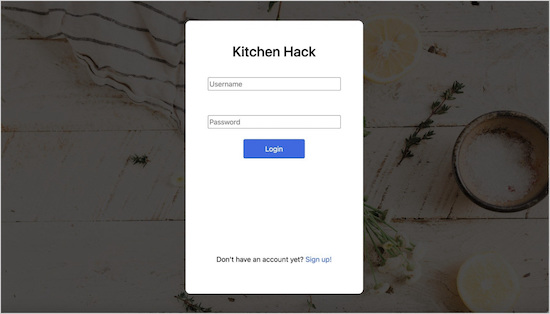
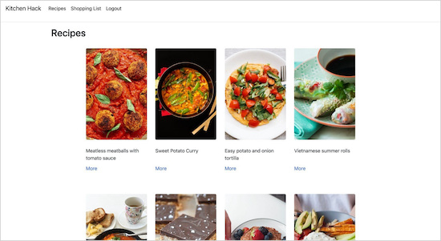
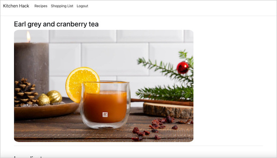
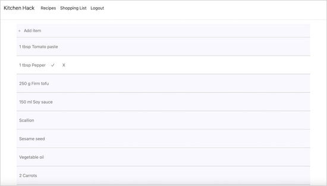

# Kitchen Hack
***Express - MongoDB - JavaScript - ES6 - Node.js - CSS - HTML***

Kitchen Hack is a project that I contributed to during an intensive 9-week coding bootcamp. After bootcamp, I remodeled the front-end and did some back-end work with the database. 

> #### Log in or sign up 
>
>
>
> #### Find a recipe you like
>
>
>
> #### View instructions & add ingredients to your shopping list
>
>
>
> #### Check off ingredients that you have
>
>
